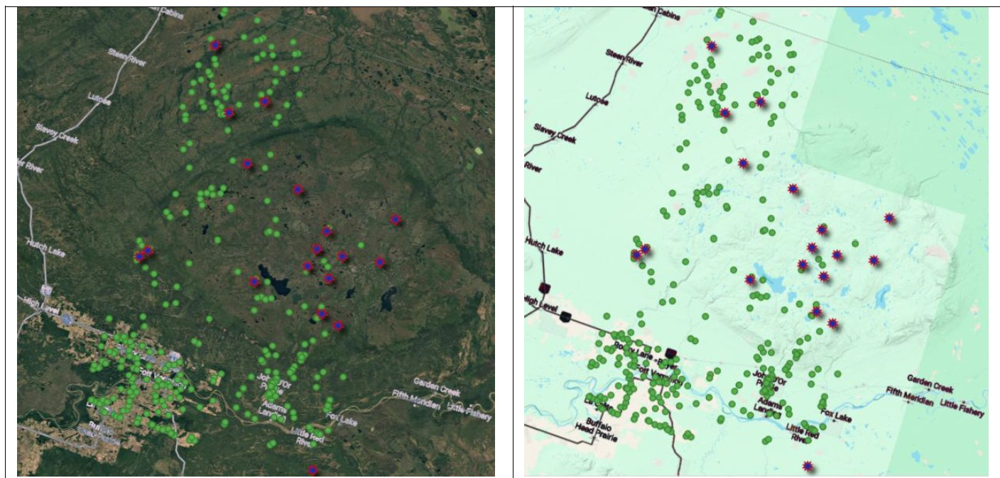

# WildFire-Data-Analysis

# Table of Contents
- [Data resources](#Data-resources)
- [Data cleaning](#Data-cleaning)
- [Data analysis](#Data-analysis)
- [References](#References)

## Data resources
The [Canadian National Fire Database (NFDB)](https://cwfis.cfs.nrcan.gc.ca/ha/nfdb) and the White Sands weather station (station id F4) are provided from ~1980 to ~2022. The NFDB dataset is provided as a shapefile (.shp) that includes points showing the occurrences of wildfires across Canada (see Figure 1). These data are publicly available through the Natural Resources Canada website. The [Whitesands F4 Excel file (.csv)](https://weather.gc.ca/en/location/index.html?coords=52.467,-112.817) has the White Sands station (located at latitude: 52.467 and longitude: -112.817) historical hourly weather information, including wind direction, wind speed, minimum temperature, maximum temperature, humidity, etc. These data can be accessed from the Government of Canada website. The NFDB and Whitesands F4 datasets have 423,832 points and 203,910 rows, respectively.

|  |
| :---: |
| Figure 1- Provided NFDB point data in QGIS. At right, information included in one selected point is provided |

## Data cleaning
Both datasets are filtered to include only May to August (month number 5 to 8) data between 2010 and 2021 (12 years). For NFDB, some extra data filtering is also applied so that the final filtered dataset only includes data from Alberta and a region with a radius of 1 degree (~111 km) centered at the Caribou Mountain Region (located at latitude: 59°11′32″N and longitude: 115°35′33″W).
To clean the NFDB data, it is first read into `geoDataFrame` using the `pandas` package in Python. Then, it is filtered according to the previously mentioned criteria. The filtered dataset has 364 points (see Figure 2; red star-shaped points show wildfires > 200 hectares).
To clean the Whitesands F4 data, it is read into `DataFrame` using the `pandas` package in Python. Then, it is filtered according to the previously mentioned criteria. The filtered dataset has 35388 rows.

|  |
| :---: |
| Figure 2 – Filtered NFDB dataset shown on QGIS, Google Satellite (left)/ Terrain (right) map is added in the background, Star-shaped points are wildfires larger than 200 hectares |

## Data analysis
* Analyzing the annual number of wildfires with time

Figure 3 shows the number of wildfires larger than 200 hectares each year from 2010 to 2021. Although climate change trends should be monitored over a longer time and considering various parameters, an increase in wildfires during recent years can clearly warn of global warming. No wildfires in 2014 and 2016 might have resulted from numerous wildfires in previous years that had already diminished the vulnerable forests. However, from 2017 to 2019, there were 2 wildfires each year, meaning that a larger amount of the forest became vulnerable, or the weather heat and dryness increased during those years. The decrease in wildfires in 2020 and 2021 could be connected to the COVID-19 era, which might result from fewer human-caused fires. This can be a subject to explore in the future. It is crucial to update the education procedures and teach people more about fire safety practices so that while they enjoy being in nature, the harm to it decreases.

|  |
| :---: |
| Figure 3 - The number of wildfires larger than 200 hectares each year from 2010 to 2021 |

These results are in accordance with a few other studies in Canada and Alberta about the increasing number of wildfires over the years. [Tymstra et al. 2020] in their review article about wildfire management in Canada, stated that the agencies should be more “prepared for a future with more wildfires”.

* Are we having hotter and dryer weather conditions over time?

Another result to consider is the months in which the most wildfires happened during these 12 years. According to the chart below (Figure 4, left), most wildfires happened during June and July. So, this question comes to mind: How has this trend changed during the past few years? Looking at the stacked bar chart below (Figure 4, right), May and August have been added to the wildfires in the Caribou Mountain Region in Alberta. This can signify longer hot and dry seasons in this area.

|  |
| :---: |
| Figure 4 - The number of wildfires larger than 200 hectares each month from 2010 to 2021 (left), and the number of wildfires larger than 200 hectares that happened each year from 2010 to 2021 colored by the month of occurrence (right) |

Another way to see if the weather conditions are getting hotter and dryer around the area during that time is to look at the temperature and relative humidity data. White Sands weather station seems to be the closest weather station in Alberta to the Caribou Mountains region. Figure 5 shows that approximately the average min and max temperatures and relative humidity did not change in months 6, 7, and 8 and month 7, respectively (their regression line slopes are close to 0). However, the average min and max temperatures in May increased, and with a slope of 0.19 and 0.29, respectively. In addition, the average relative humidity decreased in months 5, 6, and (their regression line slopes are negative). This shows that the hotter and dryer season is extending.

|  |
| :---: |
| Figure 5 - Average minimum and maximum temperatures and relative humidity from Whitesands F4 dataset separated by months from 2010 to 2021. To show their change trends, a linear regression is applied to the average measurements. |

* Analyzing the spatial spread of wildfires

Another aspect to look into is how wildfires are propagated spatially. The scatter plot below (Figure 6) shows how the wildfires have spread more toward the lower latitudes in recent years (light green and yellow coloured points). This can be a severe warning to most Albertans living in larger cities in southern parts of Alberta. This pattern shows how critical it is to monitor and prepare for wildfires, which are serious risks to people's health, air pollution, CO2 emission, and the economy. In addition, it might be a sign of more human-caused wildfires [Coogan et al. 2022] or showing that with the deforestation of higher latitudes because of past wildfires, new wildfires are dragged toward the lower latitudes. It is another subject that needs to be researched and analyzed using more data and information.

|  |
| :---: |
| Figure 6- The spatial spread of wildfires larger than 200 hectares |

* Analyzing wind direction occurrences for each month

Below, four graphs are given (Figure 7). Each graph shows the number of wind direction measurements between 2010 and 2021 for each month. The bar charts below show that the predominant wind direction is SE in May and June; however, it changes to W in July and August. According to the graphs, the change in the predominant wind direction affects wind direction occurrence in June, so the percentage of SE occurrences decreases to ~15% from ~19% in May. As a result, while in most other months, the predominant wind direction occurrence is pretty larger than the rest of the wind directions, in June, other direction occurrences of W, NW, and N get closer to SE, which can result in the predominant wind direction change in July and August to W.
Knowing wind direction and speed when wildfires occur is crucial in predicting, monitoring, and controlling fire spread. Other topographic and weather parameters like wind speed, minimum and maximum temperature, humidity, and precipitation are essential in analyzing wildfire [] data and climate change trends [Yekkehkhany 2022], too.

|  |
| :---: |
| Figure 7 - The number of wind direction measurements between 2010 and 2021 for each month |

* Data limitations

White Sands weather station, which is in the flatter region of Alberta, is a few hundred kilometers NE of the Caribou Mountains region. Therefore, their topography and weather conditions may vary to some extent. In the previous sections, it is mentioned that to give a better estimate of the trend of climate change and forecast future natural events accordingly, it is necessary to have access to more data over a more extended. Besides, the performance quality of an estimation, monitoring, and forecast model depends heavily on the data quality and quantity to train and test the model. Therefore, it becomes more crucial to consider some limitations of working with various datasets, learn how to fuse various datasets from various resources efficiently, validate the data resources, and know their reliability, accuracy, and precision. For example, considering the Whitesands F4 dataset, some limitations and considerations must be taken into account:

* The frequency of measurements is not the same during the years and for various parameters. In 1995, weather parameters were measured at 6 AM and 12 PM; in recent years, they are primarily measured every hour. The other example is that the frequency of measuring maximum and minimum temperatures during the day is not the same as the relative humidity and wind speed.

* Some measurements, like wind degrees, are missing during the earlier years.

* For some applications, having more information about how some of these measurements are done can be essential. Let’s say some sensors might get an average measurement over 10 minutes while others might do over 2 minutes. Also, knowing how many measurements the sensor takes during that period can be vital. Some sensors might get an average of their reading at the beginning and end of the measuring period, while others might do several readings. It is important to avoid missing measurements like wind gusts that often take a few seconds.

* It is necessary to provide the user terminologies used in the dataset even if they are well known. These terminologies may include any codes used to show results, like CLM in wind direction type, or abbreviations, like rh_max_h. People with different backgrounds might have difficulties understanding them clearly or mistakenly mix them with other terminologies in their minds.

* The other crucial subject to consider when working with a new dataset is knowing the measurements' measuring units. For example, while the temperature measurements are usually reported in Celsius in Canada, it is still important to provide information about the measuring units of the minimum and maximum temperatures. It becomes specially significant when combining various datasets. For example, buoy measurements of the USA and land weather stations of Canada.

* Last but not least, the one who works on any project should be clear about client requests. For example, in question 2 of Step 2 of the exam, a new data filter criteria is introduced to filter data between 2014 and 2021, which differs from what is asked in Step 1. Considering the rest of the exam questions, it is understood that it might be just a typo to write `2014` instead of `2010`. However, it is better to ask the client for clarification to ensure this. I had little time to ask, so I created the code to update it for a new year range easily if it is required.

## References
* Yekkehkhany, Bahareh. "Sea Wind Vector Estimation Using C-band Full-polarimetric SAR Data." PhD diss., University of Calgary (Canada), 2022.

* Tymstra, Cordy, Brian J. Stocks, Xinli Cai, and Mike D. Flannigan. "Wildfire management in Canada: Review, challenges and opportunities." Progress in Disaster Science 5 (2020): 100045.

* Coogan, Sean CP, Olivia Aftergood, and Mike D. Flannigan. "Human-and lightning-caused wildland fire ignition clusters in British Columbia, Canada." International Journal of Wildland Fire 31, no. 11 (2022): 1043-1055.
